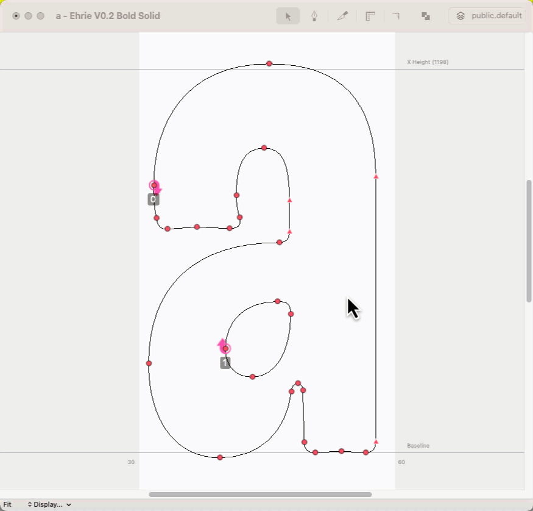

# StemPlow

Tool for measuring the thickness of the stem. You can activate it by pressing `f` in the glyph edit window.

You can edit its shortcut, behaviour and appearance by going to
`Extensions > ↔ Stem Plow Settings`.

> ## Version log:
>
> - version 1.220
>
>   - `Measure always` now can be triggered On/Off with trigger key (works when `anchor guide to the outline` is off)
>   - Some bug fixes that hopefully will work ([github issue report](https://github.com/RafalBuchner/StemPlow/issues/4#issue-1840248227))
>
> - version 1.212
>
>   - `Measure always` an option, which allows you to see the StemPlow all the time
>   - Anchoring System ( in order to turn it on check `anchor guide to the outline` in the settings, while `measure always` is on as well )
>     > When this option is turned on as well as `measure always`, use your shortcut to anchor and unanchor StemPlow to your outlines. The ruler should stick to your shape.
>   - Displaying Named Values defined with [`Laser Measure extension`](https://github.com/typesupply/lasermeasure/) by @typesupply
>   - A tiny bit rounder corners for measurement text boxes.
>   - Floating points in text boxes now depend on GlyphEditor's scale. The more you scale, the more digits appear after the floating point.
>
> - version 1.2
>
>   - Update to Merz
>   - Changing it behaviour from "tool" to "preview on hotkey."
>   - I am adding a lovely settings window.
>   - I am making it a public version.
>
> - version 1.5
>   - Support for Italic Sidebearing!!! (I've written a new algorithm for intersecting glyph defcon object with a beam based on functionality from [bezier](https://github.com/dhermes/bezier) library)
>   - New `Ignore Ovelaps` functionality!!! When it is on, StemPlow will ignore overlapping lines inside the shape of the currently edited glyph. This functionality is always ON for glyphs made only of components.
>     (checkout Stem Plow's settings)
>   - Fixed some annoying output.
>   - Anchoring is less annoying.
>     (is more understandable programmatically)
>   - I've moved StemMath to a separate repo: [stemmath](https://github.com/RafalBuchner/stemmath).

---

I've learned a lot about Subscribers and Merz while making this version of StemPlow. I wouldn't be able to do it, if not for @typesupply's laser measure extension [`Laser Measure`](https://github.com/typesupply/lasermeasure/) extension. I've based a lot of math on awesome [`Primer on Bézier curves`](https://pomax.github.io/bezierinfo/).
